# Cześć 👋

Kacper Grzeszczyk
kacgrzes.io / kacgrzes@gmail.com

---

## Jestem programistą JS / TS 🧑‍💻:

- Mobile (React Native) - 60%
- Web (React) - 30%
- Server (NodeJS) - 10%

---

## Byłem trenerem w InfoShare Academy 👨‍🏫

---

<!-- _footer: '' -->

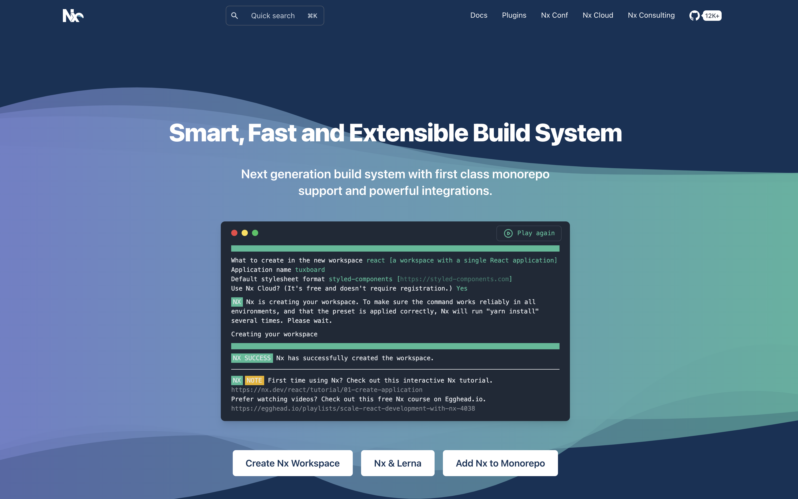

## `Budowanie wieloplatformowych aplikacji za pomocą narzędzia NX`

---

<!-- _footer: '' -->


---

## Zbudujemy klon Tittera roboczo nazwany `Tweeter` 🐣

---

## Disclaimer

> Budowanie rozbudowanego klonu na potrzeby prezentacji mija się z celem. Do aplikacji z całą pewnością da się dorzucać więcej funkcjonalności, ale celem prezki jest przede wszystkim pokazanie możliwości budowania projektów na platformie NX.

---

## Jak podejść do budowania wieloplatformowej aplikacji? 🤔

---


---

<!-- _footer: '' -->


---

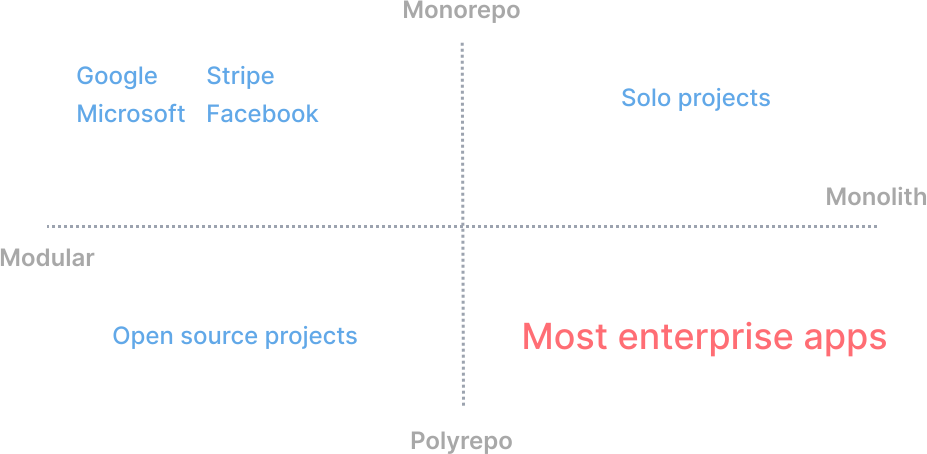

---

📖 wiecej na:
https://monorepo.tools/

---

## NX Dev

https://nx.dev

> `NX` jest jak `VSCode` wśród narzędzi do budowania. Core Nx'a umożliwia tworzenie i analizę grafu projektu, orkiestrację, wykonywanie zadań oraz generowanie kodu.

---

### Przyjrzyjmy się temu z lotu ptaka 🦅

---

## Tworzenie kodu

```sh
nx generate [generator] [project]

nx generate @nrwl/react:app my-app
nx generate @nrwl/react:lib shared-button
nx generate @nrwl/react:storybook-configuration shared-button
nx generate @nrwl/js:lib my-lib
```

Nx rozwiązuje problem konfiguracji narzędzi takich jak: Jest, Babel, TypeScript, Webpack, Prettier, Eslint

---

## Działanie na kodzie

```sh
nx [target] [project]
nx build app
nx serve app
nx test app
```

Dzięki Nx każdy projekt ma te same polecenia do budowania, testowania i uruchamiania.

---

## Rozumienie kodu

```sh
nx graph
nx list
```

Nx analizuje strukturę naszego kodu co umożliwia podglad jakie moduly są od siebie zależne, jak ze sobą współpracują. Wykrywa zmiany w kodzie co pozwala wykonywać polecenia tylko na zmodyfikowanych projektach.

---

## Zapamiętajmy i wróćmy do aplikacji...

---

## Określamy jakie ficzery sa do zaimplementowania

---

#### W aplikacjach mobilnych (ios oraz android) 📱 i w apce webowej 💻:

- przeglądanie tweetów
- dodawanie tweetow
- dodawanie komentarzy
- like / unlike tweeta

---

#### W aplikacji adminowej 💻 (next.js)

- usuwanie userów i tweetów 🤐

---

#### W aplikacji serwerowej

endpointy do wcześniej wymienionych funkcjonalności:

- auth - logowanie
- users - rejestracja, listowanie oraz usuwanie uzytkowników
- tweets - dodawanie, listowanie oraz usuwanie tweetów oraz like / unlike tweeta
- comments - listowanie, dodawanie, usuwanie komentarzy

---

## Rozpoczęcie projektu

---


---


---

<!-- TODO: -->

nie miałem projektu UI, więc na samym poczatku zacząłem od robienia aplikacji mobilnej w React Native


---

Polecenie tworzy dwie aplikacje w katalogu `apps/`

- tweeter-mobile
- tweeter-mobile-e2e

---

## NX Console

Można używać wtyczki do VSCode, która pozwala zapomnieć o poleceniach i flagach, których używalibyśmy z poziomu CLI

---


---

W kolejnym kroku zrobiłem paczkę z testowymi danymi z których będę korzystał do wypełnienia UI aplikacji.

---


---


---


---

### Ale, dane testowe będą miały określony typ

Więc generujemy kolejna paczke z typami :)

---


---

A następnie w paczce `@infoshare-f3/test-data`...

---


Importujemy typy i uzywamy do funkcji generujacej tweety

---

a następnie generujemy testowe tweety i eksporujemy z paczki


---

### Współdzielenie komponentów

Zastanowiłem się jak mozna wspoldzielic komponenty i dla samego faktu pokazania, że mozna je wspoldzielić między projektami, uznałem, ze stworzę je przy użyciu paczek: `react-native-web` oraz `tailwind`

czyli kolejna paczka..

---

<!-- _footer: '' -->


---

<!-- _footer: '' -->


---


---

### Co jesli na webie ma to wygladac inaczej?

---


---


---


---


---

Zbudowałem zestaw gotowych komponentów i wyeksportowalem je z paczki


---

### a następnie użyłem ich do budowania ekranów aplikacji

---

<!-- _footer: '' -->


---

Tworzyłem testowe dane dla wszystkich domen, podpinałem kolejne komponenty, tworzyłem ekrany i w rezultacie wyszło:

---

<!-- _footer: '' -->


---

#### Android nie wygląda juz tak dobrze, ale uruchomiłem go tylko raz :) Więc jest i tak całkiem nieźle:

---

<!-- _footer: '' -->


---

## Zostawmy na chwilę apkę mobilną

---

### Backend

Oficjalnie mamy wyboru mamy trzy pluginy:

- @nrwl/express
- @rnwl/nest
- @nrwl/node

---

## Backend

Napisalem w `express.js` za pomoca metodyki TDD (tutaj chcialem byc pewny, ze wszystko dziala jak nalezy)

---

## Instaluję kolejny generator:

```sh
npm install --save-dev @nrwl/express
```

i generuję apke za pomocą CLI 🧑‍💻

```sh
nx g @nrwl/express:app api
```

albo wyklikuję z UI 😎

---


---


---


Ta aplikacja, z perspektywy Nx nie ma wyodrębnionych bibliotek, ale zdecydowanie jest podzielona na moduły, które można by wydzielić do osobnych bibliotek.

---

`Przykład kontrolera`

<!-- Scoped style -->
<style scoped>
code {
  font-size: 50px;
  right: 0;
  position: absolute;
}
</style>


---

### Klient API

Po napisaniu backendu napisalem bibliotekę, która jest klientem do tego api

---

<!-- _footer: '' -->


Biblioteka jest zbiorem gotowych funkcji, dzięki którym komunikujemy się z API. Jeśli dorzucimy do niej typy to mamy perfekcyjną warstwę komunikacji serwer klient.

---

### Data provider

`react-query` do fetchowania i cache'owania danych. Można reużywać między aplikacjami.

---


---


---

### Kończenie aplikacji mobilnej

Wszystkie ekrany aplikacji mobilnej wyciagnalem do zewnętrznego modułu `native-screens`. Dzieki NX wygenerowanie nowego modulu jest banalnie proste.

```sh
nx g @nrwl/react-native:library native-screens
```

---

## Aplikacja webowa

wygenerowałem aplikacje webową za pomoca generatora Nx React. Użyłem gotowych komponentów z aplikacji mobilnej.

---

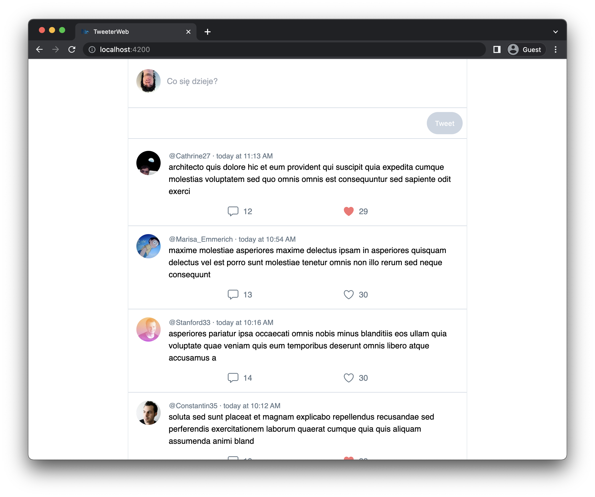

---

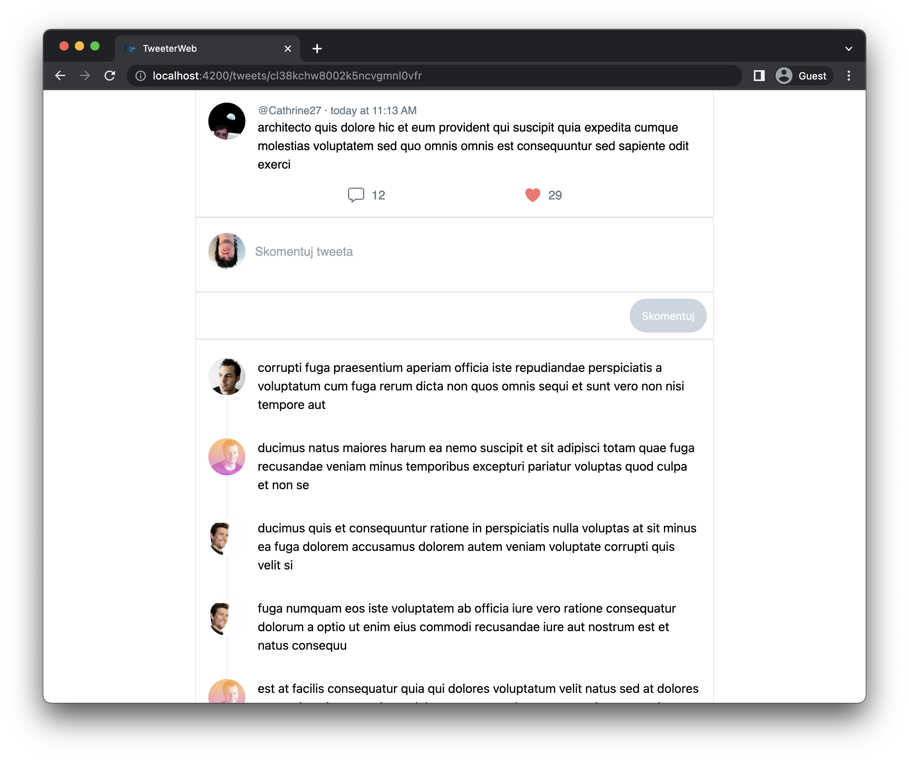

---

## Panel administratora

---

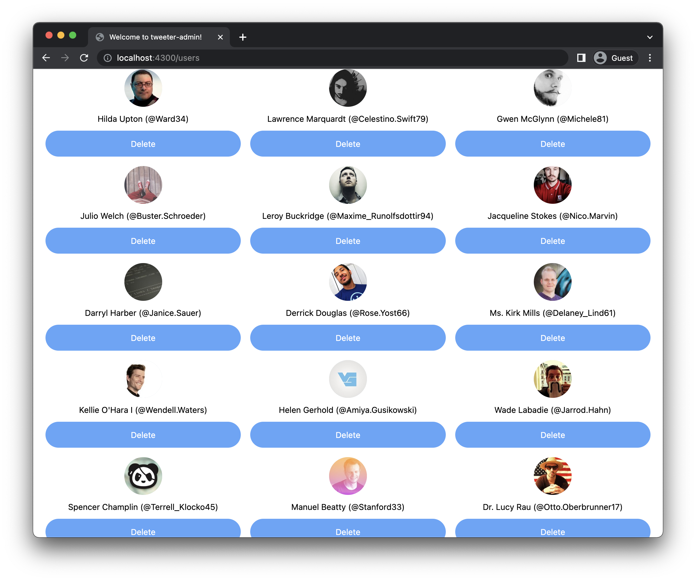

---

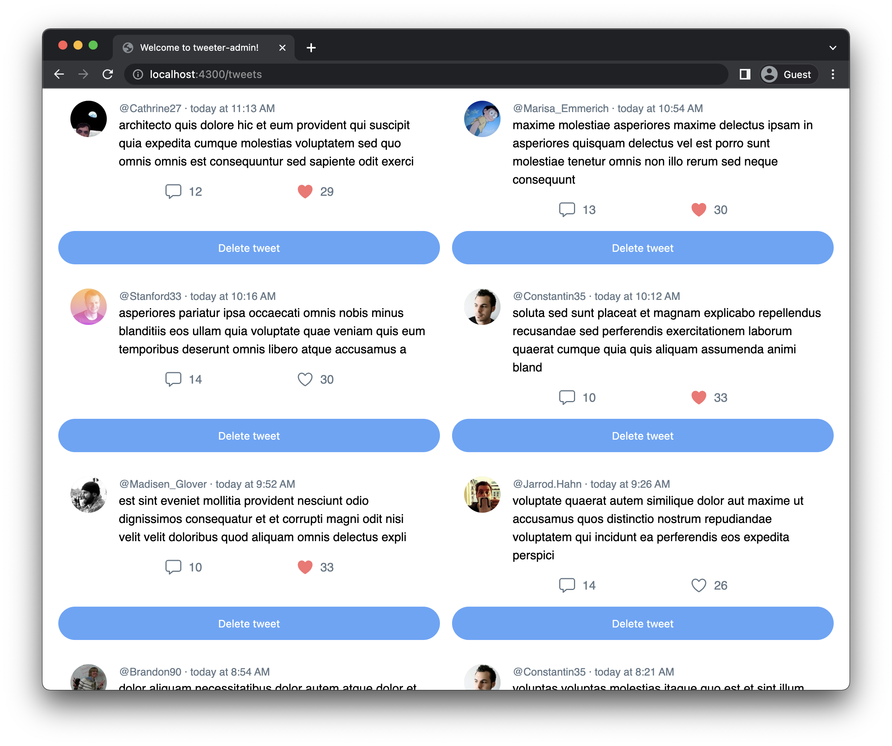

---

## Co mozna bylo jeszcze wspoldzielić poza częściami UI?

- miedzy wszystkimi aplikacjami - typy, helpery, schemas
- miedzy wszystkimi aplikacjami UI - propsy komponentów, logika formularzy, data-providers

---

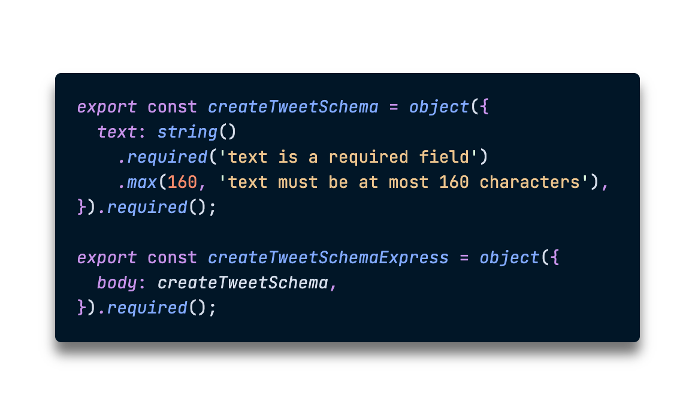

---

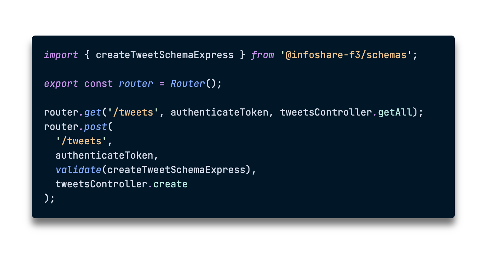

---

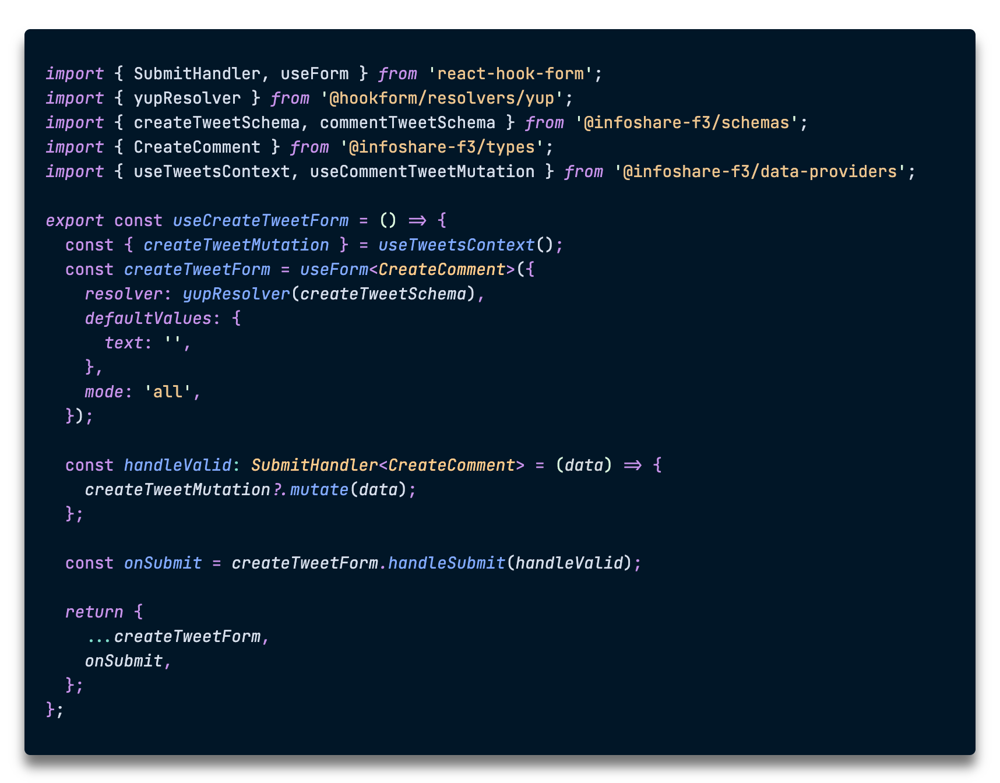

---

## Reguła którą warto zapamiętać

- 80% logiki idzie do katalogu `libs/`
- 20% do katalogu `apps/`

- `libs/` to moduły naszych aplikacji ustrukturyzowane w
- `apps/` to kontenery na te moduły

---

## Polecenia dostępne w NX z poziomu VSCode

---

<!-- _footer: '' -->


---

## Uruchamianie wielu projektów jednocześnie

---

<!-- _footer: '' -->


---

<!-- _footer: '' -->


---

<!-- _footer: '' -->


---

<!-- _footer: '' -->


---

## Generowanie grafów zaleznosci

---

<!-- Scoped style -->
<style scoped>
h2 {
  position: absolute;
  top: 20px;
  right: 20px;
  background-color: white;
}
</style>

## cały graf

<!-- _footer: '' -->

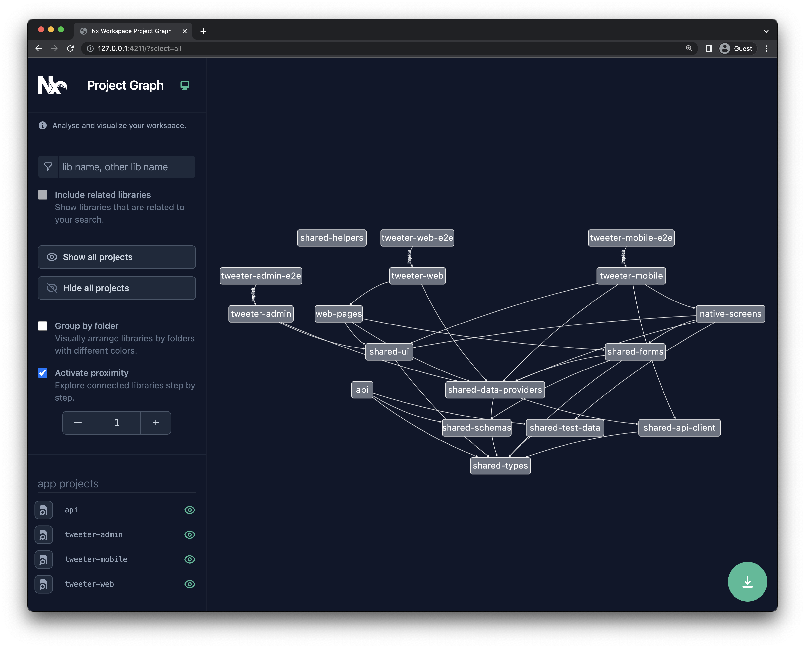

---

<!-- Scoped style -->
<style scoped>
h2 {
  position: absolute;
  top: 20px;
  right: 20px;
  background-color: white;
}
</style>

## zaleznosci apki mobilnej

<!-- _footer: '' -->

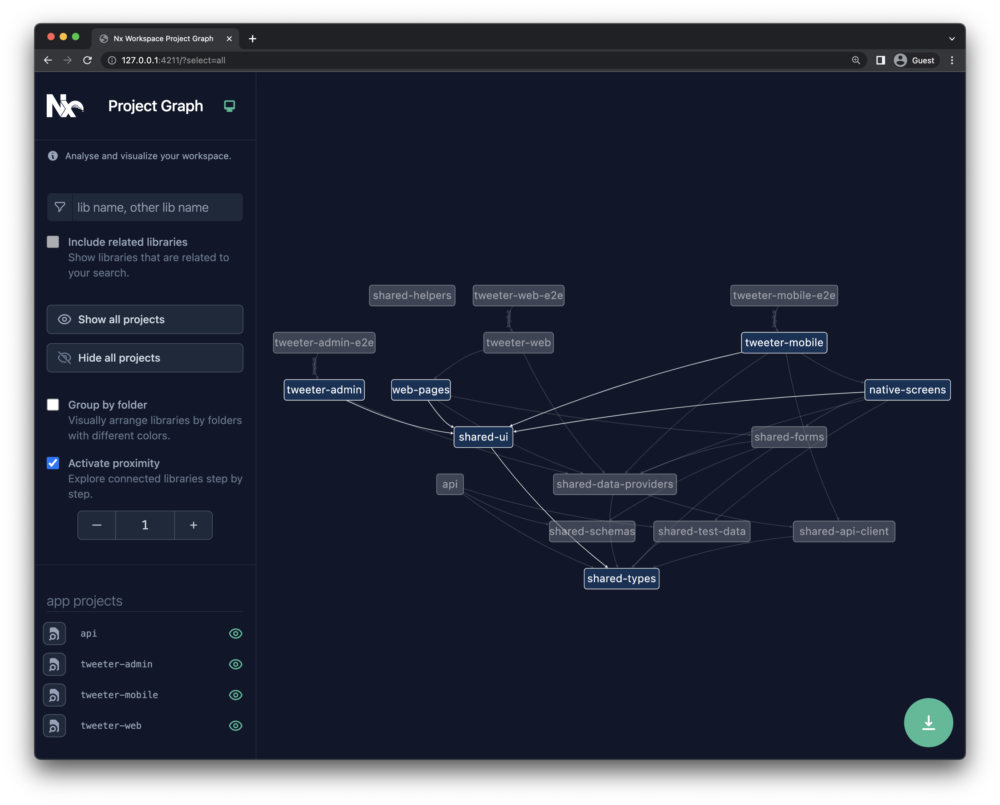

---

<!-- Scoped style -->
<style scoped>
h2 {
  position: absolute;
  top: 20px;
  right: 20px;
  background-color: white;
}
</style>

## wspoldzielone formularze

<!-- _footer: '' -->

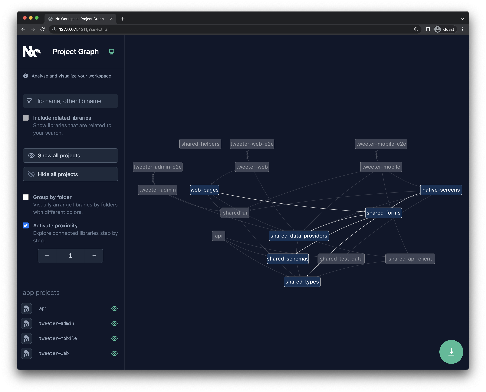

---

<!-- Scoped style -->
<style scoped>
h2 {
  position: absolute;
  top: 20px;
  right: 20px;
  background-color: white;
}
</style>

## zaleznosci api

<!-- _footer: '' -->

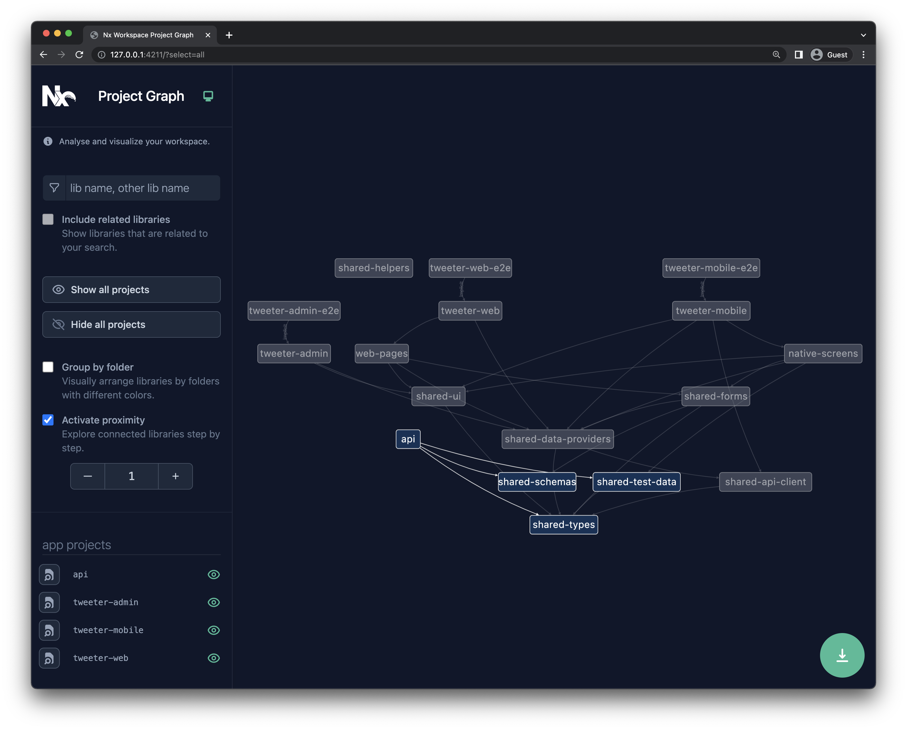

---

<!-- Scoped style -->
<style scoped>
h3 {
  position: absolute;
  top: 20px;
  right: 20px;
  background-color: white;
}
</style>

### odfiltrowana apka mobilna

<!-- _footer: '' -->

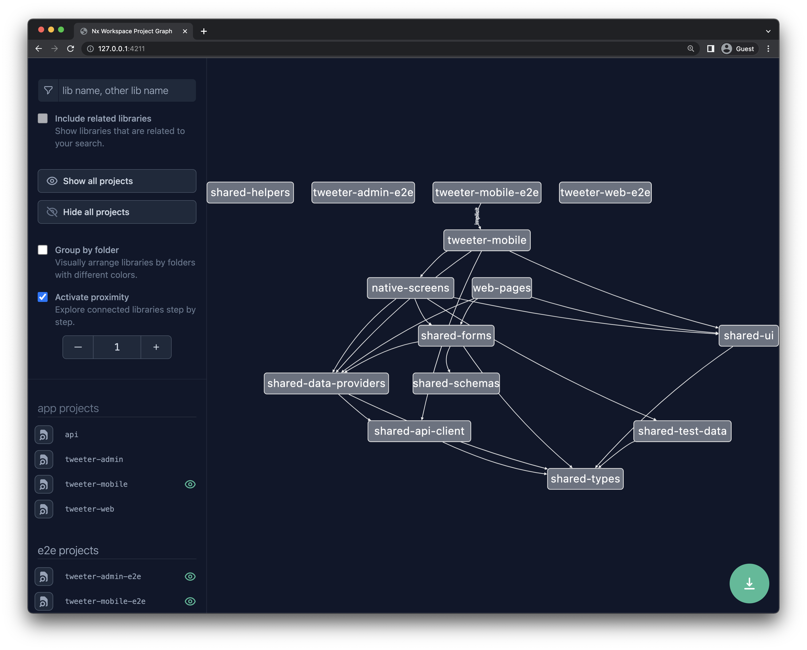

---

## co zrobiłbym lepiej?

- zacząłbym od pisania backendu
- rozbicie na środowiska, bo miałem problem przy pisaniu testow i uruchamianiem aplikacji na środowisku developerskim

---

- rozbiłbym aplikacje api na biblioteki i dzieliłbym kod domenowo

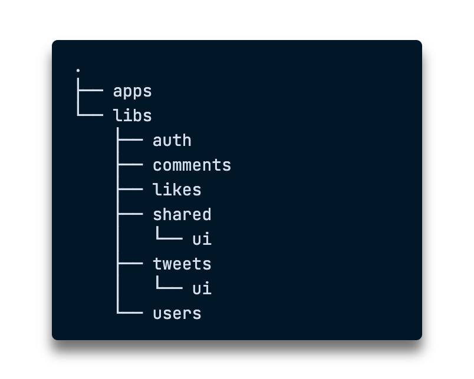

---

- przebudowałbym aplikacje webowa tak, zeby ekrany mogly byc wspoldzielone miedzy web i admin (web jest zbudowany za pomoca `create-react-app`, admin za pomoca `NextJS`)
- lepsze wspoldzielenie typów

---

# Dziękuję za uwagę!

Repo prezentacji i kodu projektu:

👨‍💻 https://github.com/kacgrzes/infoshare-f3

zachęcam do forkowania i sprawdzania możliwości Nx
