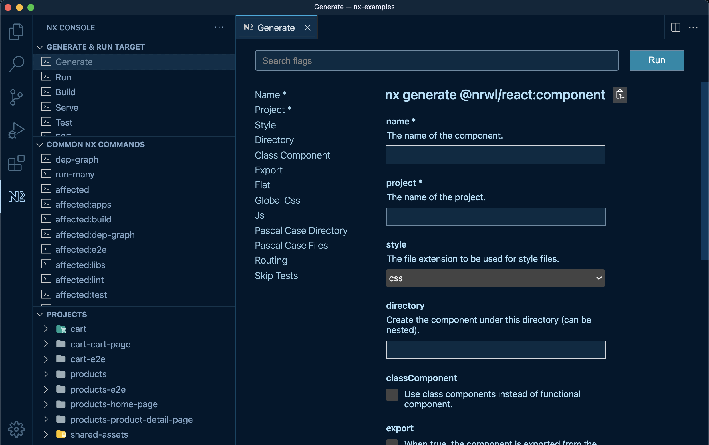

# Cześć 👋

---

## Kim jestem?

Kacper Grzeszczyk
kacgrzes.io / kacgrzes@gmail.com / @kacgrzes

---

## Czym się zajmuję na codzień?

---

## Jestem programistą JS / TS 🧑‍💻:

- Mobile (React Native) - 70%
- Web (React) - 20%
- Server (NodeJS) - 10%

---

## Długi czas byłem mentorem w InfoShare Academy 👨‍🏫

---

## O czym będzie prezentacja? 🤔

Budowanie wieloplatformowych aplikacji za pomocą narzędzia NX

---

## Co będziemy budować?

---

<!-- _header: '' -->
<!-- _footer: '' -->


## `Klon Tittera roboczo nazwany Tweeter 🐣`

---

## Disclaimer

> Budowanie rozbudowanego klonu na potrzeby prezentacji mija się z celem, a do aplikacji da się dorzucać więcej funkcjonalności. Celem prezentacji jest pokazanie mozliwosci budowania aplikacji na platformie NX.

---

## Jak podejsc do budowania wieloplatformowej aplikacji? 🤔

---

Teraz będzie trochę tekstu poprzeplatanego z obrazkami... dla potomnych

---

### 1. Sposób #1 - Polyrepo

> kazda aplikacja, projekt ma swoje wlasne repozytorium. To obecnie standard pisania aplikacji. W wielu firmach w których pracowałem tworzy sie repozytoria z monolitami. api, admin, mobile, web, kazdy projekt ma swoje wlasne repo. Jak sa jakies czesci wspolne to wyciaga sie je do osobnych repozytoriow. Często zdarza się, że każde repo ma jeden artefakt kompilacji i pipline, ktory go tworzy. Następnie inne aplikacje mogą korzystać z tych artefaktow.

---

### 2. Sposób #2 - Monorepo

> Cały kod projektu jest trzymany w jedym repozytorium z wieloma bilbliotekami / aplikacjami / projektami.

---

<!-- _header: '' -->
<!-- _footer: '' -->


---

### Monolit

> Jeśli repozytorium zawiera masywną aplikację bez podziału i hermetyzacji poszczególnych części, jest to po prostu duże repo. Można mu nadać wymyślną nazwę "garganturepo". Nie jest to jednak monorepo. W rzeczywistości takie repo jest nadmiernie monolityczne, co często jest pierwszą rzeczą, jaka przychodzi ludziom do głowy, gdy myślą o monorepo.

Monolit != Monorepo.

---

### Moduł

> oddzielny twór, przeważnie w postaci osobnego pliku, zawierający zdefiniowany interfejs, a także implementacje typów wartości, klas, zmiennych, stałych oraz treści procedur i funkcji. Jest to podstawowy element koncepcji programowania modularnego pozwalający na podział kodu programu na funkcjonalne części i umieszczenie ich w osobnych modułach, które są ponadto niezależne i wymienne.

---


---

📖 wiecej na:
https://monorepo.tools/

---

No to jedziemy, monorepo i moduły 🚀

---

## Proces budowania aplikacji

---

### Określamy jakie ficzery sa do zaimplementowania

---

#### W aplikacjach mobilnych (ios oraz android) 📱 i w apce webowej 💻:

- przeglądanie tweetów
- dodawanie tweetow
- dodawanie komentarzy
- like / unlike tweeta

---

#### W aplikacji adminowej 💻 (next.js)

- usuwanie userów i tweetów

---

#### W aplikacji serwerowej

endpointy do wcześniej wymienionych funkcjonalności:

- auth - logowanie
- users - rejestracja, listowanie oraz usuwanie uzytkowników
- tweets - dodawanie, listowanie oraz usuwanie tweetów oraz like / unlike tweeta
- comments - listowanie, dodawanie, usuwanie komentarzy

---

## NX Dev

https://nx.dev

> `NX` jest jak `VSCode` wśród narzędzi do budowania. Core Nx'a umożliwia tworzenie i analizę grafu projektu, orkiestrację, wykonywanie zadań oraz generowanie kodu.

---

## Tworzenie kodu

```sh
nx generate [generator] [project]

nx generate @nrwl/react:app my-app
nx generate @nrwl/react:lib shared-button
nx generate @nrwl/react:storybook-configuration shared-button
nx generate @nrwl/js:lib my-lib
```

---

## Działanie na kodzie

```sh
nx [target] [project]
nx build app
nx serve app
nx test app
```

---

## Rozumienie kodu

```sh
nx graph
nx list
```

---

### Start projektu

---


---


---

<!-- TODO: -->

### Brak projektu UI

nie miałem projektu UI, wiec na samym poczatku zaczalem od robienia frontu w React Native


---

Polecenie tworzy dwa projekty:

- tweeter-mobile
- tweeter-mobile-e2e

---


---

## NX Console

Mozna uzywac wtyczki do VSCode, ktora pozwala zapomniec o poleceniach i flagach do uzycia w konsoli

---



---

### Dane testowe

W kolejnym kroku zrobilem testowe dane i skorzystałem z nich w komponentach

---


---


---


---

### Dane testowe będą miały określony typ

Więc generujemy kolejna paczke z typami :)

---


---

A następnie w paczce `test-data`...

---


Importujemy typy i uzywamy do funkcji generujacej tweety

---

a nastepnie generujemy testowe tweety i eksporujemy z paczki


---

### Współdzielenie komponentów

Zastanowilem sie jak mozna wspoldzielic komponenty (dla samego faktu pokazania, ze mozna je wspoldzielic) uznalem, ze pojde w react-native-web + tailwind

---


---


---


---

Na webie ma to wygladac inaczej!

---


---


---


---


---

Zbudowałem zestaw gotowych komponentów i wyeksportowalem je z paczki


---

<!-- _header: '' -->
<!-- _footer: '' -->


---

Tworzyłem testowe dane, podpinałem kolejne komponenty tworzylem ekrany i w rezultacie wyszło:

---

<!-- _header: '' -->
<!-- _footer: '' -->


---

Android nie wygląda juz tak dobrze, ale uruchomiłem go tylko raz :)

---

<!-- _header: '' -->
<!-- _footer: '' -->


---


---

<!-- _header: '' -->
<!-- _footer: '' -->


---

<!-- _header: '' -->
<!-- _footer: '' -->


---

<!-- _header: '' -->
<!-- _footer: '' -->


---

<!-- _header: '' -->
<!-- _footer: '' -->


---

<!-- _header: '' -->
<!-- _footer: '' -->


---

### Backend

Napisalem backend w express.js za pomoca metodyki TDD (tutaj chcialem byc pewny, ze wszystko dziala jak nalezy)

---

## Instalujemy kolejny generator:

```sh
npm install --save-dev @nrwl/express
```

i generuje apke za pomoca cli 🧑‍💻

```sh
nx g @nrwl/express:app api
```

albo wyklikuje z UI 😎

---


---


---


Monolityczna aplikacja

---


---

### Klient API

Po napisaniu backendu napisalem biblioteke, ktora jest klientem do tego api

---

<!-- _header: '' -->
<!-- _footer: '' -->


---

### Data provider

`react-query` do fetchowania i cache'owania danych. Mozna reuzywac miedzy aplikacjami

---


---


---


---


---

### Kończenie aplikacji mobilnej

budowałem aplikacje mobilna na zasadzie monolitu, ale wyciagnalem wszystkie ekrany do zewnętrznego modułu `native-screens`. Dzieki NX wygenerowanie nowego modulu jest banalnie proste.

---

### Kolejno

1. wygenerowałem aplikacje webowa za pomoca generatora NX React
2. oraz aplikacje admina za pomocna generatora NX NextJS

---

## Co mozna bylo wspoldzielic?

- miedzy wszystkimi aplikacjami - typy, helpery, schemas
- miedzy wszystkimi aplikacjami UI - proste komponenty UI, propsy tych komponentów, formularze, data-providers
- api jest zbudowane w formie monolitu

---

## Reguła którą warto zapamiętać

- 80% logiki idzie do katalogu `libs/`
- 20% do katalogu `apps/`

- `libs` to moduły naszych aplikacji ustrukturyzowane w
- `apps` to kontenety na te moduły

---

## co zrobilbym lepiej?

apka duza, a czasu malo wiec nie byłem w stanie wszystkiego zrobić, ale jezeli mialbym cos zrobic lepiej to:

- z perspektywy czasu zaczalbym od pisania backendu
- rozbicie na środowiska, bo byl problem przy pisaniu testow i testowaniem aplikacji
- rozbiłbym aplikacje api na moduły chociaz nie mam pomyslu jak :)
- przebudowałbym aplikacje webowa tak, zeby ekrany moglybyc wspoldzielone miedzy web i admin (web jest zbudowany za pomoca `create-react-app`, admin za pomoca `NextJS`)
- lepsze wspoldzielenie typów

---

## Pytania / pomysly?

---

# Dziękuję za uwagę!

<!-- TODO: tutaj link do repo -->

Link do repo:

---

---

# Tworzenie projektu

---

```sh
❯ npx create-nx-workspace@latest
Need to install the following packages:
create-nx-workspace@latest
Ok to proceed? (y) y
✔ Workspace name (e.g., org name)     · infoshare-f3
✔ What to create in the new workspace · apps
✔ Use Nx Cloud? (It's free and doesn't require registration.) · No

> NX Nx is creating your v14.0.3 workspace.

To make sure the command works reliably in all environments, and that the preset is applied correctly,
Nx will run "npm install" several times. Please wait.

✔ Installing dependencies with npm
✔ Nx has successfully created the workspace.

```

---

# Co jest w środku?

---

```sh
.
├── README.md
├── apps
├── libs
├── nx.json
├── package.json
├── tools
│   ├── generators
│   └── tsconfig.tools.json
├── tsconfig.base.json
├── workspace.json
└── package-lock.json
```

<Notes>

- `/apps/` contains the application projects. This is the main entry point for a runnable application. We recommend keeping applications as light-weight as possible, with all the heavy lifting being done by libraries that are imported by each application.
- `/libs/` contains the library projects. There are many kinds of libraries, and each library defines its own external API so that boundaries between libraries remain clear.
- `/tools/` contains scripts that act on your code base. This could be database scripts, custom executors, or workspace generators.
- `/workspace.json` lists every project in your workspace. (this file is optional)
- `/nx.json` configures the Nx CLI itself. It tells Nx what needs to be cached, how to run tasks etc.
- `/tsconfig.base.json` sets up the global TypeScript settings and creates aliases for each library to aid when creating TS/JS imports.

</Notes>

---

A common mental model is to see the application as "containers" that link, bundle and compile functionality implemented in libraries for being deployed. As such, if we follow a 80/20 approach:

- place 80% of your logic into the libs/ folder
- and 20% into apps/

---

## Co budujemy?

- serwer
- aplikacja mobilna działająca na iOS i Android
- aplikacja desktopowa działająca na Windows, Mac i Linux
- aplikacja webowa działająca w przeglądarkach

---

- executors / builders - buduja, lintuja, testuja, serwuja, generalnie wykonuja akcje na kodzie
- generators - Generators provide a way to automate many tasks you regularly perform as part of your development workflow. Whether it is scaffolding out components, features, ensuring libraries are generated and structured in a certain way, or updating your configuration files, generators help you standardize these tasks in a consistent, and predictable manner.
- pluginy - dzieki nim mozna budowac gotowe generatory i executory

---

Library types

Feature libraries:

Developers should consider feature libraries as libraries that implement smart UI (with access to data sources) for specific business use cases or pages in an application.

UI libraries:

A UI library contains only presentational components (also called "dumb" components).

Data-access libraries:

A data-access library contains code for interacting with a back-end system. It also includes all the code related to state management.

Utility libraries:

A utility library contains low-level utilities used by many libraries and applications.

---

Feature Libraries

What is it?

A feature library contains a set of files that configure a business use case or a page in an application. Most of the components in such a library are smart components that interact with data sources. This type of library also contains most of the UI logic, form validation code, etc. Feature libraries are almost always app-specific and are often lazy-loaded.

Naming Convention

feature (if nested) or feature-\* (e.g., feature-home).

Dependency Constraints

A feature library can depend on any type of library.

```
libs/
└── my-app/
    └── feature-home/
        └── src/
            ├── index.ts
            └── lib/
```

feature-home is the app-specific feature library (in this case, the "my-app" app).

---

UI Libraries
What is it?

A UI library is a collection of related presentational components. There are generally no services injected into these components (all of the data they need should come from Inputs).

Naming Convention

ui (if nested) or ui-\* (e.g., ui-buttons)

Dependency Constraints

A ui library can depend on ui and util libraries.

---

Data-access Libraries
What is it?

Data-access libraries contain code that function as client-side delegate layers to server tier APIs.

All files related to state management also reside in a data-access folder (by convention, they can be grouped under a +state folder under src/lib).

Naming Convention

data-access (if nested) or data-access-\* (e.g. data-access-seatmap)

Dependency Constraints

A data-access library can depend on data-access and util libraries.

---

Utility Libraries
What is it?

A utility library contains low level code used by many libraries. Often there is no framework-specific code and the library is simply a collection of utilities or pure functions.

Naming Convention

util (if nested), or util-\* (e.g., util-testing)

Dependency Constraints

A utility library can depend only on utility libraries.

An example ui lib module: libs/shared/util-formatting

```
export { formatDate, formatTime } from './src/format-date-fns';
export { formatCurrency } from './src/format-currency';
```

---

Other Types
You will probably come up with other library types that make sense for your organization. That's fine. Just keep a few things in mind:

Keep the number of library types low
Clearly document what each type of library means

---

Grouping Libraries
Libraries should be grouped by scope. A library's scope is either application to which it belongs or (for larger applications) a section within that application.

---

Move Generator
Don't be too anxious about choosing the exact right folder structure from the beginning. Libraries can be moved or renamed using the @nrwl/workspace:move generator.

For instance, if a library under the booking folder is now being shared by multiple apps, you can move it to the shared folder like this:

```sh
nx g move --project booking-some-library shared/some-library
```

---

Remove Generator
Similarly, if you no longer need a library, you can remove it with the @nrwl/workspace:remove generator.

```
nx g remove booking-some-library
```

---

## Aplikacja tweeter (klon twittera)

- kazdy moze czytac tweety
- zalogowany user moze dodawac, like'owac, "komentowac" tweety
- admin moze blokowac tweety

---

## Generujemy pierwszą aplikację (Express)

```sh
npm install --save-dev @nrwl/express
```

```sh
nx g @nrwl/express:app api
```

---

Co się stało?

---

Nowe pliki:

- apps/api
- jest.config.ts
- jest.preset.ts
- .eslintrc.json

---

Modyfikacja plików:

- nx.json

```json
{
  // ...
  "cli": {
    "defaultCollection": "@nrwl/express"
  },
  // ...
  "defaultProject": "api"
}
```

---

- workspace.json

```json
{
  "projects": {
    "api": "apps/api"
  }
}
```

---

- package.json

```json
{
  "devDependencies": {
    "@nrwl/cli": "14.0.3",
    "@nrwl/eslint-plugin-nx": "14.0.3",
    "@nrwl/express": "^14.0.3",
    "@nrwl/jest": "14.0.3",
    "@nrwl/linter": "14.0.3",
    "@nrwl/node": "14.0.3",
    "@types/express": "4.17.13",
    "@types/jest": "27.4.1",
    "@types/node": "16.11.7",
    "@typescript-eslint/eslint-plugin": "~5.18.0",
    "@typescript-eslint/parser": "~5.18.0",
    "eslint": "~8.12.0",
    "eslint-config-prettier": "8.1.0",
    "jest": "27.5.1",
    "ts-jest": "27.1.4",
    "ts-node": "9.1.1"
  },
  "dependencies": {
    "express": "4.17.2",
    "tslib": "^2.3.0"
  }
}
```

---

## Generujemy drugą aplikację (React Native)

```sh
npm install @nrwl/react-native --save-dev
```

```sh
nx g @nrwl/react-native:app tweeter-mobile
```

---

## Co się zmieniło?

- Zostały utworzone dwa projekty - `tweeter-mobile` oraz `tweeter-mobile-e2e`
- dorzucony został plik `babel.config.json`
- dorzucone zostały projekt w `workspace.json`

---

## Trzecia aplikacja (Create React App)

```sh
npm install @nrwl/react --save-dev
```

```sh
nx g @nrwl/react:app tweeter-web
```

```sh
❯ nx g @nrwl/react:app tweeter-web
✔ Which stylesheet format would you like to use? · none
✔ Would you like to add React Router to this application? (y/N) · true
```

---

## Co się zmieniło?

- `nx.json`

```json
  // ...
  "generators": {
    "@nrwl/react": {
      "application": {
        "style": "none",
        "linter": "eslint",
        "babel": true
      },
      "component": {
        "style": "none"
      },
      "library": {
        "style": "none",
        "linter": "eslint"
      }
    }
  }
  // ...
```

---

- `workspace.json`

```json
{
  // ...
  "projects": {
    // ...
    "tweeter-web": "apps/tweeter-web",
    "tweeter-web-e2e": "apps/tweeter-web-e2e"
  }
}
```

---

- Doszły nowe projekty (`tweeter-web` oraz `tweeter-web-e2e`)

---

## Czwarta aplikacja (Next.js)

```sh
npm install --save-dev @nrwl/next
```

```sh
nx g @nrwl/next:app tweeter-admin
```

```sh
❯ nx g @nrwl/next:app tweeter-admin
✔ Which stylesheet format would you like to use? · css
```

---

## Co się zmieniło?

---

- `nx.json`

```json
{
  // ...
  "generators": {
    // ...
    "@nrwl/next": {
      "application": {
        "style": "css",
        "linter": "eslint"
      }
    }
  }
}
```

---

- `package.json`

---

- `workspace.json`

```json
{
  // ...
  "projects": {
    // ...
    "tweeter-admin": "apps/tweeter-admin",
    "tweeter-admin-e2e": "apps/tweeter-admin-e2e"
    // ...
  }
}
```

## Piąta aplikacja...

Wystarczy, chociaz mozemy tak w nieskończoność :)

---

## Uruchamianie wszystkich aplikacji jednocześnie

---

## Stylowanie aplikacji mobilnej

```sh
npm install twrnc --legacy-peer-deps
```

```sh
npm install tailwindcss@latest postcss@latest autoprefixer@latest concurrently@latest --save-dev
```

---

Tworzenie biblioteki UI

```sh
npx nx g @nrwl/react:lib ui
```

---

## Tworzenie generatora

```sh
nx generate @nrwl/workspace:workspace-generator my-generator
```
